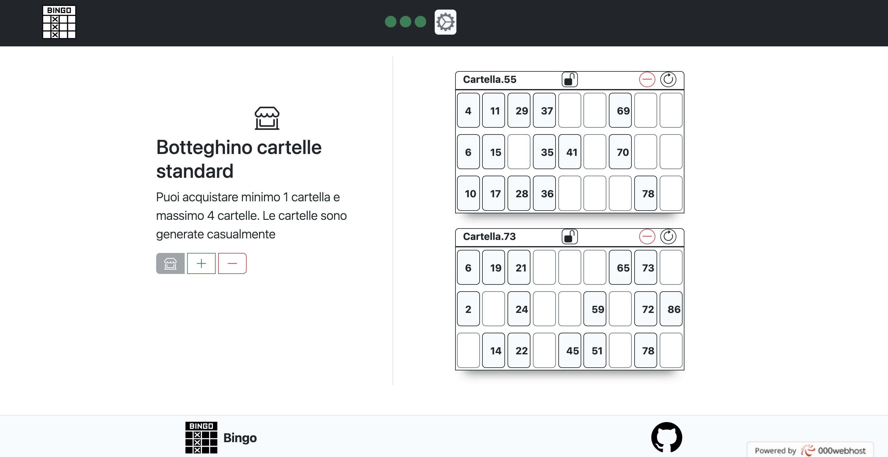

# Documentazione Tombola Online

## Indice

1. [Introduzione](#1-introduzione)
2. [Tecnologie Utilizzate](#2-tecnologie-utilizzate)
3. [Struttura del Progetto](#3-struttura-del-progetto)
4. [Componenti Principali](#4-componenti-principali)
5. [Routing](#5-routing)
6. [Gestione dello Stato](#6-gestione-dello-stato)
7. [Chiamate API](#7-chiamate-api)
8. [Gestione delle Eccezioni](#8-gestione-delle-eccezioni)
9. [Stili](#9-stili)
10. [Testing](#10-testing)
11. [Avvio e Sviluppo Locale](#11-avvio-e-sviluppo-locale)
12. [Distribuzione](#12-distribuzione)
13. [Conclusione](#13-conclusione)


## Introduzione

Il progetto Tombola Online si propone di rendere l'esperienza di gioco della Tombola in un'applicazione web multi player offrendo un'esperienza utente con le seguenti features.


### Indice

1. [Inizio della Partita](#Inizio-della-Partita)
2. [Preparazione al Gioco](#Preparazione-al-Gioco)
3. [Fase di Gioco](#Fase-di-Gioco)

---

### Inizio della Partita


L'utente sceglie il proprio username e  crea la partita generando il codice alla partita o vi accede selezionando uno dei codici delle partite in corso

>[!IMPORTANT]
>Solo se l'utente ha effettuato l'accesso in una partita può accede alle funzionalità online del gioco

### Preparazione al Gioco


Gli utenti solo dopo aver effettuato l'accesso possono abilitare la fase di gioco e quindi acquistare o le cartelle del tabellone o quelle del botteghino in modo che il gioco inizi solo se tutti hanno comprato almeno una cartella e solo se il creatore avvia la partita


### Fase di Gioco


In questa fase le funzionalità del multiplayer sono abilitate quindi attreverso un menu interattivo l'utente può beneficiare delle seguenti features:


#### Features del gioco

#### Indice

1. [Acquisto Cartelle Botteghino](#acquisto-cartelle-botteghino)
2. [Acquisto Cartelle Botteghino Tabellone](#acquisto-cartelle-botteghino-tabellone)

---

##### Acquisto Cartelle Botteghino




##### Acquisto Cartelle Botteghino Tabellone


#### Features multiplayer

#### Indice

2. [Lista partecipanti](#Lista-partecipanti)
3. [Chat di gruppo](#Chat-di-gruppo)
4. [Classifica giocatori](#Classifica-giocatori)
5. [Numeri estratti](#Numeri-estratti)

---


##### Lista partecipanti


Lista dei partecipanti i relativi stati
- Stato grigio se l'utente non ha comprato nessuna cartella
- Stato verde se l'utente ha comprato almeno una cartella
- Stato blu se l'utente è pronto al gioco

##### Chat di gruppo


Chat di gioco per interagire con gli altri utenti

>[!WARNING]
>Nessuna censura delle parole inappropriate

>[!TIP]
>In future implementazioni la censura delle parole inappropriate

##### Classifica giocatori


Classifica dei giocatori e dei premi riscattati

##### Numeri estratti


Visualzizazione di tutti i numeri estratti

## 2. Tecnologie Utilizzate


### Indice

1. [Teconologie Backend](#Teconologie-Backend)
2. [Teconologie Frontend](#Teconologie-Frontend)

---


### Teconologie Backend


[`SQL`](#SQL)&ensp;&ensp;&ensp;[`PHP`](#PHP)

### Teconologie Frontend

[`Javascript`](#Javascript)&ensp;&ensp;&ensp;[`HTML`](#HTML)&ensp;&ensp;&ensp;[`CSS`](#CSS)&ensp;&ensp;&ensp;[`Bootstrap`](#Bootstrap)&ensp;&ensp;&ensp;


## 3. Struttura del Progetto

### Indice

1. [Organizzazione dei Componenti Grafici](#organizzazione-dei-componenti-grafici)
2. [Vantaggi Strutturali](#vantaggi-strutturali)
3. [Struttura dei File in un Albero di Path](#struttura-dei-file-in-un-albero-di-path)

---

### Organizzazione dei Componenti Grafici

L'organizzazione dei componenti grafici è dinamica e sviluppata  sugli oggetti in `JavaScript ES6`

### Vantaggi Strutturali

- **Modularità e Riutilizzo del Codice** 

- **Organizzazione e Chiarezza Strutturale** 

- **Incapsulamento e Separazione delle Responsabilità**

- **Estensibilità e Scalabilità**

- **Maggiore Manutentibilità** 

### Struttura dei File in un Albero di Path

- **index**

   _Directory principale del progetto con tutti gli stili e gli script js e php ._
  - <a id="index"></a>`index.php`: _Contiene il codice per la pagina principale del sito web ._
  - <a id="server"></a>`server.php`: _Contiene il codice per gestire le richieste provenienti dal client e le operazioni sul lato server ._

  - **src/**
    
     _Directory principale del codice sorgente._
    - <a id="style"></a>**style/**

       _Contiene tutti i fogli di stile css sviluppati e di bootstrap._
       - `stile.css`: _Foglio di stile con gli stili globali per tutto il progetto._
     
    - <a id="script"></a>**script/**

       _Contiene tutti gli script sviluppati e di bootstrap._
       - `script.js`: _Script che sviluppa tutta la logica del progetto e la grafica._
     

      


## 4. Componenti Principali
Elenco e descrizione dei componenti principali utilizzati nel frontend, con eventuali screenshot e descrizione.

| Nome Form            | Descrizione Form                                                                                                                    | Immagine Form    |
|----------------------|--------------------------------------------------------------------------------------------------------------------------------------|------------------|
| Menu Interattivo     | Utilizzato per interagire tra i partecipanti e per visualizzare i dati della partita multigiocatore.                                 | |
| Botteghio Cartelle   | Per comprare cartelle al botteghino.                                                                                                 | |
| Botteghino Tabellone | Per comprare cartelle al tabellone del botteghino.                                                                                    | |

## 5. Routing

Il sito è progettato in modo **one-page** quindi è privo di un sistema di routing in quanto le richieste vengono gestite direttamente senza reindirizzamenti di pagina.

### Motivazione:

- **Gestione Dinamica dei Componenti Grafici**
- **Esperienza Utente Fluida e Interattiva**
- **Semplificazione della Logica di Navigazione**

## 6. Gestione dello Stato

Per la gestione degli stati dei componenti non è stato necessario utilizzate librerie esterne come `vis.js`

- **Variabili JavaScript**
- **Gestione Stati JavaScript**


## 7. Chiamate API

Le chiamate API dal frontend sono state utilizzate per interagire con il backend e scambiare dati tra il client e il server in questa applicazione web tramite la libreria Axios.

### Indice

1. [Utilizzo di Axios](#utilizzo-di-axios)
2. [Principali vantaggi di Axios](#principali-vantaggi-di-axios)
3. [Interfaccia consistente](#interfaccia-consistente)
4. [API Utilizzate](#api-utilizzate)

---

### Utilizzo di Axios

Axios è una libreria JavaScript che semplifica il processo di effettuare chiamate HTTP dal frontend. È particolarmente popolare per la sua facilità d'uso, la sua flessibilità e il suo supporto per le richieste asincrone. 

### Principali vantaggi di Axios:

- **Facilità d'uso**: Axios offre un'API intuitiva e semplice da utilizzare per effettuare richieste HTTP, rendendo facile interagire con API esterne o interne al progetto.
  
- **Supporto per le richieste asincrone**: Axios supporta le richieste asincrone tramite l'utilizzo di Promises o async/await, consentendo di gestire facilmente operazioni di rete che richiedono tempo.

- **Interfaccia consistente**: Axios fornisce un'interfaccia coerente per la gestione di vari tipi di richieste HTTP GET e POST semplificando la scrittura del codice e la comprensione delle operazioni di rete.

### Benefici delle chiamate API con Axios

Effettuare chiamate API con Axios dal frontend offre diversi vantaggi:

1. **Comunicazione con il backend**: Axios consente al frontend di comunicare con il backend dell'applicazione, scambiando dati e informazioni in modo efficiente.

2. **Gestione degli errori**: Axios fornisce un'ampia gestione degli errori per le chiamate API, consentendo di gestire facilmente situazioni di errore e di fornire feedback agli utenti.

3. **Facilità di integrazione**: Grazie alla sua facilità d'uso, Axios può essere integrato facilmente all'interno di progetti React, Angular, Vue.js e altre applicazioni frontend.

4. **Flessibilità**: Axios offre una vasta gamma di opzioni di configurazione e personalizzazione per adattarsi alle esigenze specifiche dell'applicazione.

### API Utilizzate

Nel frontend sono state utilizzate le seguenti API per consentire al client di interagire con le risorse del sistema:

| API                  | Tipo    | Descrizione                                                 |
|----------------------|---------|-------------------------------------------------------------|
| **`/autenticaUtente`**       | **POST**                  | Gestisce il processo di **autenticazione dell'utente** con opportuni controlli per [gestire le eccezioni](#autenticazione-utente). |
| **`/registraCliente`**      |**POST**                       | Gestisce la **registrazione di un cliente** con opportuni controlli per [gestire le eccezioni](#registrazione-cliente). |
| **`/visualizzaClienti`**           | **GET**      | Restituisce la **visualizzazione dei clienti** memorizzati nel database con opportuni controlli per [gestire le eccezioni](#visualizzazione-clienti). |


> [!NOTE]  
> Per informazioni dettagliate sulla gestione degli errori per le singole API consultare il paragrafo di [Gestione delle Eccezioni](#8-gestione-delle-eccezioni).


>In sintesi, Axios è stata una scelta affidabile per gestire le chiamate API dal frontend dell'applicazione web, offrendo una solida base per la comunicazione tra client e server.


## 8. Gestione delle Eccezioni

### Indice 

1. [Globale](#Globale)
2. [Autenticazione Utente](#autenticazione-utente)
3. [Registrazione Cliente](#registrazione-cliente)
4. [Visualizzazione Clienti](#visualizzazione-clienti)

---

### Codici di stato HTTP 

Il [backend](../Server/README.md#8-gestione-delle-eccezioni) gestisce le eccezioni in modo appropriato, restituendo codici di stato HTTP appropriati e fornendo informazioni dettagliate sugli errori al client. Ciò aiuta a garantire una gestione sicura e robusta delle richieste, fornendo al client tutte le informazioni necessarie per comprendere e gestire correttamente gli errori durante le interazioni con il backend.

#### Globale

- **`200` (OK):** Operazione completata con successo e le modifiche sono state salvate nel database.
- **`404` (Not Found):** Impossibile accedere al server. La risorsa richiesta non è stata trovata.
- **`500` (Internal Server Error):** Si è verificato un errore interno.

#### Autenticazione Utente

- **`405` (Method Not Allowed):** Risposta in caso la password fornita non è corretta.
- **`409` (Conflict):** Risposta in caso l'utente non esista nel sistema.
  
#### Registrazione Cliente

- **`409` (Conflict):** Il codice fiscale fornito è già presente nel sistema.
- **`400` (Bad Request):** I dati forniti per la registrazione non sono validi.

#### Visualizzazione Clienti

- **`500` (Internal Server Error):** Si è verificato un errore interno durante il recupero dell'elenco dei clienti.

> [!WARNING]  
> La gestione delle eccezioni è contestualizzata all'API di riferimento quindi a stessi codici di stato HTTP in diverse API corrispondono errori diversi


## 9. Stili


Nel frontend del progetto, la gestione degli stili è stata fondamentale per garantire un'interfaccia utente coerente e accattivante. 

### Lista Stili

[`Ant Design`](#stiliAntDesign)&ensp;&ensp;&ensp;[`CSS personalizzati`](#stiliCSSPersonalizzati)&ensp;&ensp;&ensp;[`CSS Bootstrap`](#stiliCSSBootstrap)

---

Qui di seguito vengono delineati gli approcci utilizzati per gestire gli stili:

- <a id="stiliAntDesign"></a>[**Ant Design**](#AntDesign): La libreria di componenti UI per React, Ant Design, è stata ampiamente impiegata per accedere a componenti già stilizzati e pronti all'uso. Questi componenti predefiniti hanno permesso di risparmiare tempo nello sviluppo e di ottenere un'interfaccia utente coesa e professionale.

- <a id="stiliCSSPersonalizzati"></a>[**Fogli di stile CSS personalizzati** ](#CSSPersonalizzati): Per adattare ulteriormente l'aspetto dei componenti di Ant Design alle specifiche esigenze del progetto, sono stati utilizzati fogli di stile CSS personalizzati. Questi fogli di stile consentono di sovrascrivere o estendere le regole di stile predefinite per ottenere un design coerente con il tema generale dell'applicazione.

- <a id="stiliCSSBootstrap"></a>[**Integrazione di classi di stile Bootstrap**](#Bootstrap): Per ampliare le funzionalità e sfruttare componenti specifici offerti da Bootstrap, sono state integrate classi di stile Bootstrap all'interno dell'applicazione. Questo approccio ha permesso di combinare le caratteristiche di entrambe le librerie per ottenere un'interfaccia utente versatile e ben strutturata.

> [!IMPORTANT]
> Le personalizzazioni degli stili sono state apportate solo nei fogli di stile CSS sorgente, senza modificare direttamente le classi predefinite di Bootstrap o Ant Design. Questo garantisce un controllo flessibile sull'aspetto dell'applicazione, mantenendo la coerenza e semplificando la manutenzione del codice.


## 10. Testing

Breve panoramica dei test unitari e di integrazione effettuati sul frontend 

### Indice

1. [Test Effettuati](#test-effettuati)
2. [Benefici dei Test](#benefici-dei-test)
3. [Esito dei Test](#esito-dei-test)

---


### Test Effettuati

- **Test Unitari**: Sono stati sviluppati test unitari per verificare il corretto funzionamento dei singoli componenti e delle funzioni utilizzate nell'applicazione. Questi test hanno consentito di individuare eventuali bug e garantire che ogni componente si comporti come previsto in condizioni specifiche.

- **Test di Integrazione**: Sono stati eseguiti test di integrazione per verificare l'interazione tra diversi componenti e le varie parti dell'applicazione. Questi test sono stati utili per assicurare che le varie parti dell'applicazione funzionino correttamente insieme e che non vi siano problemi di compatibilità o conflitti tra di esse.

> [!NOTE]
> - La complessità del progetto non ha richiesto l'utilizzo di framework esterni per il testing come Jest.
> 
> - La [struttura del progetto](#3-struttura-del-progetto) in termini di organizzazione del codice ha facilitato la manutenibilità a livello di test, consentendo di scrivere e mantenere i test in modo efficiente.
   


### Benefici dei Test

- **Miglioramento della Qualità**: I test hanno contribuito a migliorare la qualità complessiva dell'applicazione, individuando e risolvendo bug e problemi prima che possano influenzare gli utenti finali.

- **Riduzione dei Rischi**: Effettuando test regolari, si è ridotto il rischio di errori e malfunzionamenti nell'applicazione, garantendo un'esperienza utente più fluida e priva di problemi.

- **Aumento della Fiducia**: L'utilizzo di test ha aumentato la fiducia nello sviluppo e nel rilascio dell'applicazione, fornendo una valida garanzia che ogni cambiamento o aggiornamento non provochi regressioni o problemi imprevisti.


### Esito dei Test

Tutti i test finali hanno dato esito positivo, confermando la stabilità della build.

<a id="WARNING"></a>
> [!WARNING]
> In [`FloatButtonGroup`](#FloatButtonGroup) messaggio di avvertimento per `findDOMNode` che è deprecato in StrictMode. È stato suggerito di aggiungere un ref direttamente all'elemento di riferimento anziché utilizzare `findDOMNode`

> [!WARNING]
> In [`FloatButtonGroup`](#FloatButtonGroup) `findDOMNode` è deprecato in StrictMode quindi aggiungere un ref all'elemento di riferimento anziché utilizzare `findDOMNode`

> [!WARNING]
> In [`VisualizzaClientiView`](#VisualizzaClientiView) per il componente `Dropdown` `findDOMNode` l'uso di `visible` è deprecato quindi è stato consigliato di utilizzare `open`

> [!WARNING]
> In [`VisualizzaClientiView`](#VisualizzaClientiView) l'uso di funzioni ref nei componenti funzionali è stato sconsigliato.

> [!WARNING]
> In [`VisualizzaClientiView`](#VisualizzaClientiView) è stata segnalata la mancanza di chiavi univoche per i figli nella lista.


<a id="TIP"></a>
> [!TIP]
> Tra gli sviluppi futuri un'opportuna **migrazione e aggiornamento** di questi componenti deprecati per garantire la compatibilità e le prestazioni ottimali del sistema.


## 11. Avvio e Sviluppo Locale

Istruzioni su come avviare il frontend in modalità di sviluppo locale, con eventuali prerequisiti e comandi necessari.

### Indice

1. [Prerequisiti](#prerequisiti)
2. [Istruzioni](#istruzioni)

---

### Prerequisiti:
1. **Node.js `v20.11.0`** installato sul sistema.
2. Gestore di pacchetti **npm `v10.3.0`** o **yarn `v4.1.0`**.


### Istruzioni:
1. **Clonare il Repository:** Assicurasi di aver clonato il repository del progetto frontend sul sistema locale.
   
   ```
   git clone <URL_del_repository>
   ```

3. **Installare le Dipendenze:** Utilizzare il gestore di pacchetti npm o yarn per installare le dipendenze del progetto. Occorre eseguire il comando seguente nella directory del progetto:
   
   ```
   npm install
   ```
   oppure

   ```
   yarn install
   ```

4. **Avviare il Server di Sviluppo:** Dopo aver installato le dipendenze, avviare il server di sviluppo locale eseguendo il comando:
   
   ```
   npm start
   ```
   oppure

   ```
   yarn start
   ```

6. **Accesso all'Applicazione:** Una volta avviato il server di sviluppo, l'applicazione sarà disponibile all'indirizzo *http://localhost:3000* nel browser. Accedere all'applicazione visitando questo URL.
   


## 12. Distribuzione
Breve guida su come distribuire il frontend in un ambiente di produzione.

### Indice

1. [Prerequisiti per la Distribuzione](#prerequisiti-per-la-distribuzione)
2. [Istruzioni per la Distribuzione](#istruzioni-per-la-distribuzione)

---

Le configurazioni necessarie per la distribuzione sono sviluppate nei seguenti passaggi:

### Prerequisiti per la Distribuzione:
1. Necessita di avere **accesso a un server Web** per ospitare l'applicazione frontend.
2. **Disporre delle credenziali di accesso al server** per caricare i file del frontend.

### Istruzioni per la Distribuzione:
1. **Build dell'Applicazione:** Prima di distribuire il frontend, è necessario generare una build ottimizzata dell'applicazione. Esegui il comando seguente nella directory del progetto per eseguire la build:
   
   ```
   npm run build
   ```
   oppure

   ```
   yarn build
   ```

4. **Configurazione del Server:** Una volta completata la build, carica i file generati nella directory "build" su un server Web. Assicurasi di configurare correttamente il server per servire i file statici dell'applicazione.
5. **Verifica:** Dopo aver caricato i file del frontend sul server, verifica che l'applicazione sia accessibile e funzionante. Puoi farlo visitando l'URL del tuo dominio o indirizzo IP nel browser.
6. **Aggiornamenti e Manutenzione:** Una volta distribuita l'applicazione, assicurarsi di monitorare regolarmente le prestazioni e il funzionamento del frontend. Effettua aggiornamenti e manutenzione quando necessario per garantire la continuità del servizio e la sicurezza del sistema.


## 13. Conclusione

Il frontend del progetto "Gestionale" offre un'esperienza utente intuitiva e funzionale grazie all'impiego di tecnologie moderne come React, Axios e Ant Design. La struttura organizzativa del progetto e l'efficace gestione dello stato mantengono il codice pulito e manutenibile. L'integrazione di test unitari assicura una buona qualità del codice. In sintesi, il frontend è ben progettato, reattivo e pronto per offrire un'esperienza utente di alta qualità.


### Indice

1. [Ringraziamenti](#ringraziamenti)
2. [Riferimenti aggiuntivi](#riferimenti-aggiuntivi)
3. [Supporto e collaborazione futura](#supporto-e-collaborazione-futura)

---

### Ringraziamenti

Desideriamo ringraziare il team di sviluppo per il loro impegno e dedizione nel portare avanti questo progetto. 

| Ruolo          | Nome            | Email                        | GitHub                                           |
|----------------|-----------------|------------------------------|-----------------------------------------------|
| Gestore Backend| Reda Karimi     | redakarimi76@gmail.com      | [redakarimi](https://github.com/redakarimi)  |
| Gestore Frontend| Vittorio Piotti| vittoriopiotti.vp@gmail.com | [vittoriopiotti](https://github.com/vittoriopiotti) |


### Riferimenti aggiuntivi

Per contribuire al progetto, ricevere informazioni o segnalare bug fare riferimento ai seguenti link:


| Issues Repository GitHub                        | Email Aziendale                  | Email Privata                  |
|------------------------------------------|---------------------------------|--------------------------------|
| [Repository](https://github.com/vittorioPiotti/Gestionale/issues) | gestionale.dev@gmail.com                | redakarimi76@gmail.com                        |
|  |                |                           vittoriopiotti.vp@gmail.com     |


### Supporto e collaborazione futura

Siamo aperti a nuove collaborazioni e siamo disponibili a offrire supporto per l'implementazione del progetto in altri contesti o per eventuali miglioramenti futuri. Non esitate a contattarci per ulteriori dettagli o proposte di collaborazione.

Grazie ancora a tutti coloro che hanno reso possibile il successo di questo progetto!


> [!NOTE]
> Consultare il [README globale del progetto](../) per ulteriori informazioni.


